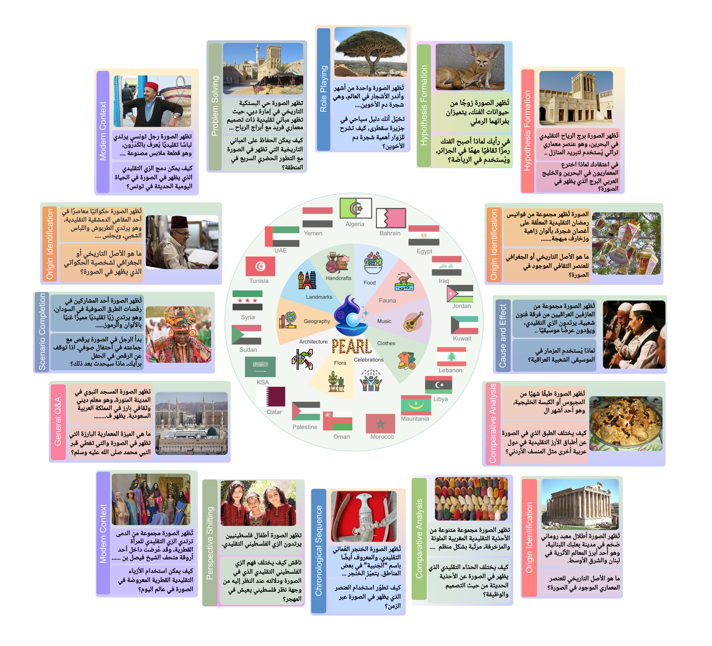
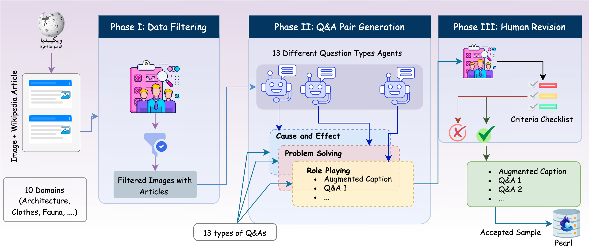
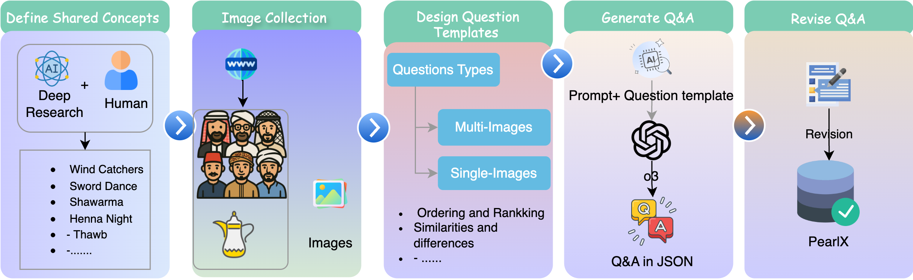
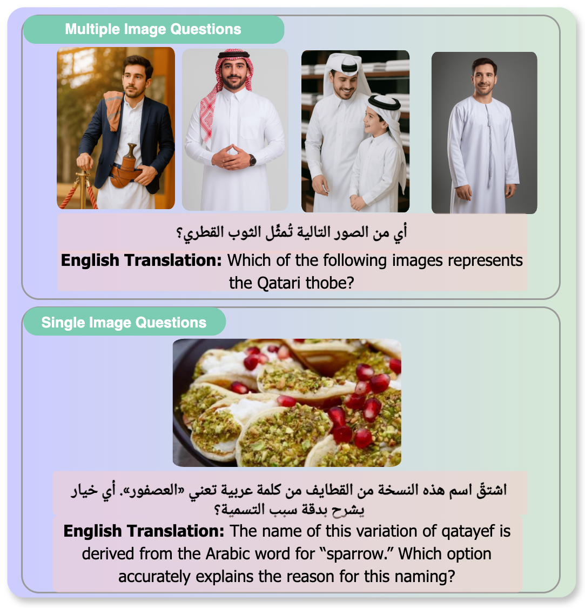

# PEARL: A Multimodal Culturally-Aware Arabic Instruction Dataset

<div align="center">


[](http://arxiv.org/abs/2505.21979)
[](https://huggingface.co/datasets/UBC-NLP/PEARL)
[](https://huggingface.co/datasets/UBC-NLP/PEARL-LITE)
[](https://huggingface.co/datasets/UBC-NLP/PEARL-X)
[](https://github.com/UBC-NLP/pearl)

</div>

## Abstract

Mainstream large vision-language models (LVLMs) inherently encode cultural biases, highlighting the need for diverse multimodal datasets. To address this gap, we introduce PEARL, a large-scale Arabic multimodal dataset and benchmark explicitly designed for cultural understanding. Constructed through advanced agentic workflows and extensive human-in-the-loop annotations by 45 annotators from across the Arab world, PEARL comprises over 309K multimodal examples spanning ten culturally significant domains covering all Arab countries. We further provide two robust evaluation benchmarks (PEARL and PEARL-LITE) along with a specialized subset (PEARL-X) explicitly developed to assess nuanced cultural variations. Comprehensive evaluations on state-of-the-art open and proprietary LVLMs demonstrate that reasoning-centric instruction alignment substantially improves models' cultural grounding compared to conventional scaling methods. PEARL establishes a foundational resource for advancing culturally-informed multimodal modeling research. All datasets and benchmarks are publicly available.

## Overview

<div align="center">

</div>

Pearl is a comprehensive benchmark for evaluating and training Vision-Language Models (VLMs) on Arab cultural understanding. The benchmark includes culturally-grounded question-answer pairs that test models' ability to perceive, understand, and reason about Arab cultural content in images. PEARL is the outcome of an extensive collaborative effort involving a diverse community of 45 contributors, all of whom are authors of this work, spanning the Arab region. By leveraging advanced agentic workflows alongside iterative human-in-the-loop refinement, our dataset integrates sophisticated LLM and LVLM outputs with the nuanced cultural expertise of native annotators. Covering ten culturally significant domains, PEARL authentically captures Arab cultural heritage. Moreover, we structure it around ten distinct question categories designed to test sophisticated LVLM capabilities, including hypothesis formation, problem-solving, comparative analysis, and chronological sequencing.

## PEARL: Core Dataset for Cultural VLM Training and Benchmarking

<div align="center">

</div>

PEARL provides a substantial core dataset, encompassing over 309,000 culturally-rich multimodal examples, designed for both the training and benchmarking of Vision-Language Models (VLMs) with a focus on Arab cultural contexts. This extensive collection, developed through advanced agentic workflows and refined by 45 native annotators, covers 10 significant cultural categories (e.g., architecture, clothing, cuisine, festivals) and 13 diverse question types that probe various cognitive skills like causal reasoning, comparative analysis, and hypothesis formation. Its scale and richness make it an ideal resource for instruction-tuning VLMs to enhance their cultural awareness and reasoning capabilities.

From this large dataset, the **PEARL benchmark** is a meticulously curated subset of 6,867 high-quality Question/Answer pairs. Selected via a rigorous two-stage human evaluation, this benchmark (workflow depicted above) is tailored for robust model assessment and includes:
- A strategic mix of question formats: 5,310 closed-form (multiple-choice, True/False) and 1,557 open-ended questions.
- Comprehensive evaluation metrics: assessing correctness, coherence, detail, and fluency.
- Nuanced, culturally-aware assessment: often employing an LVLM-as-judge framework.

This dual-faceted approach—offering a broad dataset for training and a specialized benchmark for evaluation—establishes PEARL as a key resource for advancing culturally-informed multimodal AI.

## PEARL-X: Single and Multi-Image Evaluation of Shared Cultural Concepts

<div align="center">

</div>

<div align="center">

</div>

To specifically evaluate subtle cultural variations overlooked by existing benchmarks, we also introduce PEARL-X, a novel benchmark highlighting culturally shared yet visually distinct concepts (e.g., coffee) across different Arab contexts. Unique among benchmarks, PEARL-X incorporates both text-to-single-image and text-to-multiple-image pairings, enabling richer assessments of LVLM performance on complex multimodal tasks. We manually identified 61 such culturally shared concepts, each observed across at least two Arab countries. On average, we gathered approximately three representative images per concept, for a total of 347 images. In total, we produce 367 questions, split into 177 single-image and 190 multiple-image questions.

PEARL-X extends the benchmark to multi-image scenarios, testing models' ability to:
- **Compare and contrast** cultural elements across multiple images
- **Synthesize information** from different visual sources
- **Perform complex reasoning** with multi-modal inputs
- **Handle diverse image combinations** and cultural contexts

This extension provides a more challenging evaluation that mirrors real-world applications where models need to process and understand multiple visual inputs simultaneously.

## Contributions

The main contributions of this work include:

1. **PEARL Dataset and Benchmarks**: We introduce PEARL, a large-scale Arabic multimodal instruction dataset, and two robust evaluation benchmarks (PEARL and PEARL-LITE) explicitly designed for cultural understanding, comprising over 309K examples covering ten culturally significant domains across the Arab world.

2. **Culturally-Nuanced Evaluation (PEARL-X)**: We develop PEARL-X, a specialized benchmark to assess nuanced cultural variations of shared concepts across different Arab contexts using both single and multi-image evaluation.

3. **Agentic Workflow with Human-in-the-Loop**: We design and implement an advanced agentic workflow combined with extensive human-in-the-loop refinement by 45 native annotators to ensure high-quality, culturally-relevant content.

4. **Comprehensive LVLM Evaluation**: We conduct systematic evaluations of state-of-the-art open and proprietary LVLMs, demonstrating that reasoning-centric instruction alignment substantially improves cultural grounding compared to conventional scaling.

5. **Open Resource for Culturally-Informed AI**: We publicly release all datasets, benchmarks, and associated resources to foster research in culturally-informed multimodal modeling.

## Repository Structure

```
pearl/
├── data_generation/     # Dataset generation pipeline
├── eval/               # Evaluation scripts and tools
├── assets/            # Figures and visual assets
└── README.md          # This file
```

## Evaluation

For detailed information about running evaluations on the PEARL benchmark, including setup instructions, model evaluation scripts, and result analysis tools, please refer to the [`eval/`](eval/) folder. The evaluation pipeline supports multiple VLMs and provides comprehensive scoring across all benchmark dimensions. Our evaluation protocol adopts two distinct scoring methods: relaxed-match accuracy (ACC) for closed-form questions and a structured rubric (correctness, coherence, detail, fluency, and Cultural Awareness Score - CAS) for open-ended questions, primarily using LVLM-as-judge.

## Quick Start

### Using the Datasets

```python
from datasets import load_dataset

# Load PEARL main benchmark
pearl_dataset = load_dataset("UBC-NLP/PEARL")

# Load PEARL-LITE (subset)
pearl_lite = load_dataset("UBC-NLP/PEARL-LITE")

# Load PEARL-X (multi-image)
pearl_x = load_dataset("UBC-NLP/PEARL-X")
```

### Running Evaluation

```bash
# Navigate to evaluation directory
cd eval/

# Follow instructions in eval/README.md for detailed setup
# Run model evaluation
./run_generate_pearl.sh

# Score the results
./run_scoring.sh

# Collect and analyze results
python collect_results.py
```


## Dataset Versions

- **PEARL**: Complete benchmark with full evaluation suite
- **PEARL-LITE**: Lightweight version for quick evaluation
- **PEARL-X**: Extension for evaluating shared concepts
- **PEARL-Z**: Full generated datasets for training purposes (coming soon)


## Citation

If you use PEARL in your research, please cite our paper:
```bibtex
@article{Alwajih2025pearl,
  title={Pearl: A Multimodal Culturally-Aware {A}rabic Instruction Dataset},
  author={Fakhraddin Alwajih and Samar M. Magdy and Abdellah El Mekki and Omer Nacar and Youssef Nafea and Safaa Taher Abdelfadil and Abdulfattah Mohammed Yahya and Hamzah Luqman and Nada Almarwani and Samah Aloufi and Baraah Qawasmeh and Houdaifa Atou and Serry Sibaee and Hamzah A. Alsayadi and Walid Al-Dhabyani and Maged S. Al-shaibani and Aya El aatar and Nour Qandos and Rahaf Alhamouri and Samar Ahmad and Razan Khassib and Lina Hamad and Mohammed Anwar AL-Ghrawi and Fatimah Alshamari and Cheikh Malainine and Doaa Qawasmeh and Aminetou Yacoub and Tfeil moilid and Ruwa AbuHweidi and Ahmed Aboeitta and Vatimetou Mohamed Lemin and Reem Abdel-Salam and Ahlam Bashiti and Adel Ammar and Aisha Alansari and Ahmed Ashraf and Nora Alturayeif and Sara Shatnawi and Alcides Alcoba Inciarte and AbdelRahim A. Elmadany and Mohamedou cheikh tourad and Ismail Berrada and Mustafa Jarrar and Shady Shehata and Muhammad Abdul-Mageed},
  journal={arXiv preprint arXiv:2505.21979},
  year={2025}
}
```

